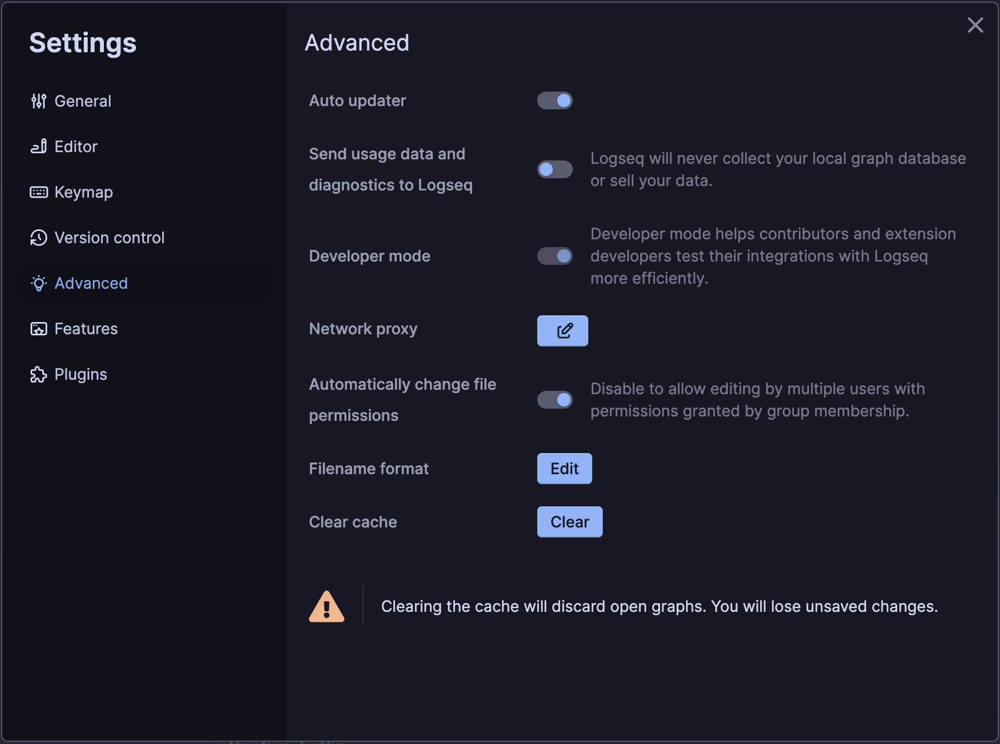
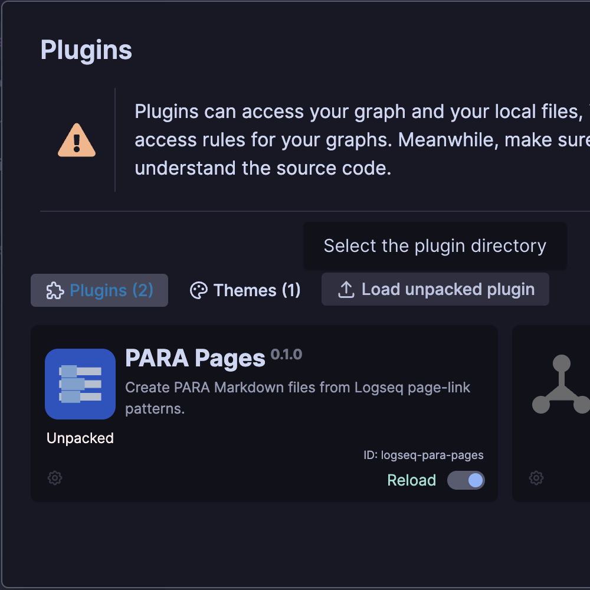
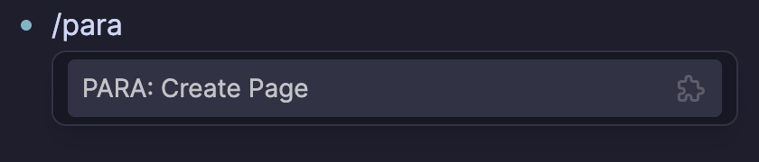
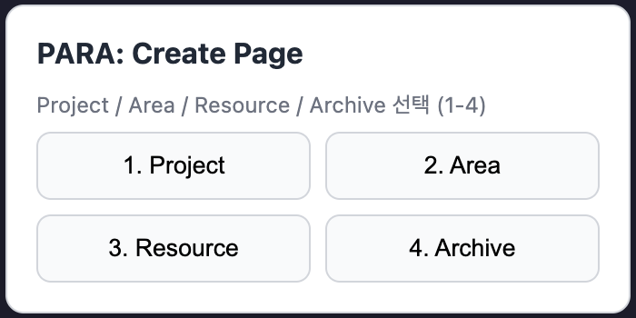
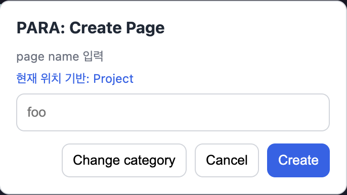
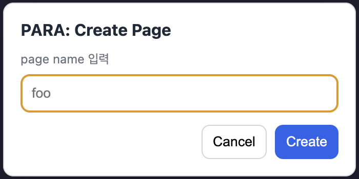
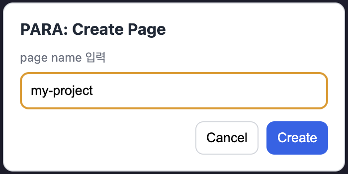
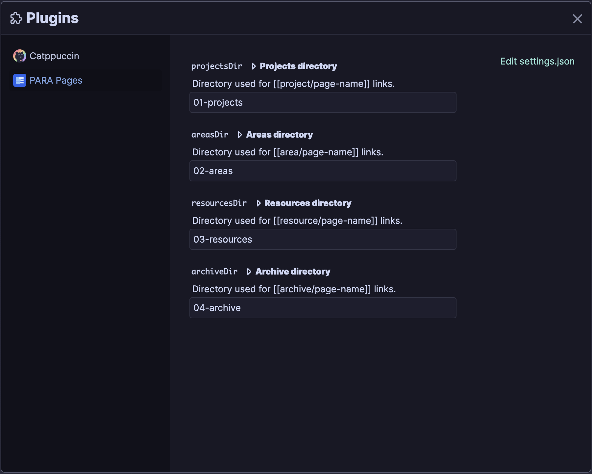

# PARA Pages

English · [한국어](./README.md)

PARA Pages is a Logseq Desktop plugin that creates PARA pages from the `/para` slash command and inserts a standard page link (`[[page-name]]`) at the current cursor position.

> **Compatibility:** Supports file graphs (Markdown) in Logseq Desktop. DB graphs and the web version are not supported.

## Features

- Create PARA pages with the `/para` slash command
- Choose from Project, Area, Resource, and Archive categories
- Use number keys `1`, `2`, `3`, and `4` for quick category selection
- Automatically select the category when the current page is inside a PARA directory
- Create Markdown files in the selected category's PARA directory
- Add the `para:: <kind>` page property to created, moved, and existing pages
- Avoid adding duplicate `para:: ...` properties
- Attempt to move a matching page from Logseq's default `pages` directory into its PARA directory
- Insert a `[[page-name]]` link at the current cursor position after Logseq indexes the page

## Local installation

Running the plugin directly from source requires [Bun](https://bun.sh/). Clone the project, install its dependencies, and build the plugin bundle.

```bash
git clone https://github.com/bossm0n5t3r/logseq-para-pages.git
cd logseq-para-pages
bun install
bun run build
```

> `index.html` loads `dist/index.js`.
> After changing the source, run `bun run build` and reload the plugin in Logseq.

Enable `Developer mode` under `Settings` → `Advanced` in Logseq Desktop.



Then open `Plugins`, select `Load unpacked plugin`, and choose this project directory.



## Usage

1. Type `/para` in a Logseq block.
2. Run `PARA: Create Page` from the slash command list.

   

3. Select a PARA category.

   - `1` = Project
   - `2` = Area
   - `3` = Resource
   - `4` = Archive
   - `Esc` = Cancel

   If the current page is inside a PARA directory such as `01-projects`, `02-areas`, `03-resources`, or `04-archive`, the plugin automatically selects that category and opens the page name step. Select `Change category` to choose a different category.

   

   

4. Enter a page name and select `Create`.

   

5. The plugin prepares the Markdown file and inserts a link at the current cursor position.

   

## Example

With the default settings, selecting Project and entering `my-project` creates:

```text
01-projects/my-project.md
```

The Markdown file contains:

```markdown
para:: project
```

When the page is ready, the plugin inserts:

```markdown
[[my-project]]
```

If the page already exists or is moved from Logseq's default `pages` directory, the plugin adds the `para:: ...` property when it is missing.



| Category | Page name     | Created or moved file         | Inserted link     | Added property    |
| -------- | ------------- | ----------------------------- | ----------------- | ----------------- |
| Project  | `my-project`  | `01-projects/my-project.md`   | `[[my-project]]`  | `para:: project`  |
| Area     | `my-area`     | `02-areas/my-area.md`         | `[[my-area]]`     | `para:: area`     |
| Resource | `my-resource` | `03-resources/my-resource.md` | `[[my-resource]]` | `para:: resource` |
| Archive  | `old-page`    | `04-archive/old-page.md`      | `[[old-page]]`    | `para:: archive`  |

If the page name includes a `.md` extension, the plugin removes it from both the file name and the inserted link.

> The plugin currently supports only the `/para` slash command, not the Command Palette.

## Settings

You can change the PARA directory names in the Logseq plugin settings.



The default settings are:

```json
{
  "projectsDir": "01-projects",
  "areasDir": "02-areas",
  "resourcesDir": "03-resources",
  "archiveDir": "04-archive"
}
```

Each value is a path relative to the current graph root.

## Development

```bash
bun install
bun test
bun run typecheck
bun run build
```

After building, load this project directory as a plugin in Logseq. Rebuild and reload the plugin after making source changes.

### Implementation notes

- The Markdown creation and `para:: <kind>` property logic is in `src/para-metadata.ts`.
- The plugin adds missing `para:: <kind>` properties to new, moved, and existing files.
- After preparing a page, the plugin inserts its link at the current editing cursor. If cursor insertion fails, it appends the link to the original block.
